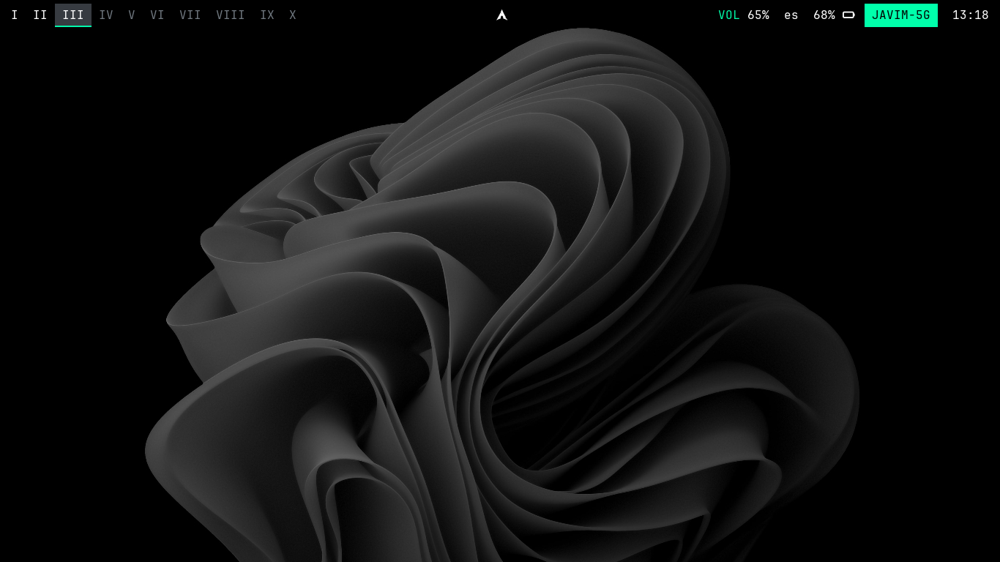
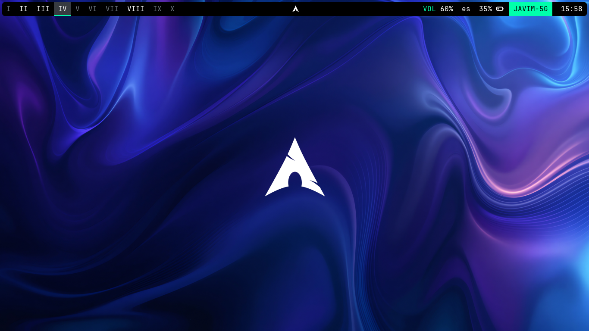

# AWFF






Yeah, It's AWFF

## Contenido

/ (root)

📄 .xprofile (file) ✓

📂 .config (folder)

- 📁 bspwm (folder) ✓

- 📁 sxhkd (folder) ✓

- 📁 polybar (folder) ✓

- 📁 kitty (folder) ✓

📁 Backgrounds (folder) ✓

📁 Screenshots (folder) ✓ (solo la carpeta, para ser enviada a repo y luego si ignorarla para que no se suban las screenshots personales, pero si se pueda obtener la carpeta para la herramienta de Scrot)

📁 carpetaZeroDistroUSB (folder) [ ] Crear comando de variable de entorno con la opción (osea, un condicional con bash) de montar o desmontar dispositivos usb, y luego si mostrarlos

---

Excepciones
## 1. Archivo para establecer gestos/toques de panel tactil (laptop)

Reemplazar/Pegar el archivo 40-libinput.conf en la ruta /etc/X11/xorg.conf.d/

## 2. Archivo para establecer distribución de teclado permanente

Reemplazar/Pegar el archivo 00-keyboard.conf en la ruta /etc/X11/xorg.conf.d/

---

## AWUSB

### 1. Darle permisos al archivo ```awusb```

```sh
chmod +x ~/awusb
```

### 2. Muévelo a ```/usr/local/bin```

sudo mv ~/awusb /usr/local/bin/awusb

### 3. Listo. Usar :)

Para montar un dispositivo usb ```awusb mount``` y para desmontar ```awusb unmount```


---

## Rofi

## 1. Install Rofi

sudo pacman -S picom

sudo pacman -S rofi

## 2. Entrar a la carpeta REPOS/ROFITHEMES 

cd REPOS/ROFITHEMES/

### 3. If you don't have the directories needed for the install create them with:

mkdir -p ~/.local/share/rofi/themes/

### 4. Copy your desired theme to ~/.local/share/rofi/themes folder:

cp themes/your-selected-theme ~/.local/share/rofi/themes/

> I  liked spotlight.rasi OR windows11-list-light.rasi

### 5. Select theme in Rofi

Ingrsar en la terminal ```rofi -show run```, buscar ```rofi-theme-selector```, presionar Enter, seleccionar el tema de Rofi a establecer, y finalmente para confirmarlo presionar Alt+a


## Agregarlo al archivo sxhkd
# Lanzar rofi mostrando iconos de aplicaciones
super + @space
    rofi -show drun -show-icons
